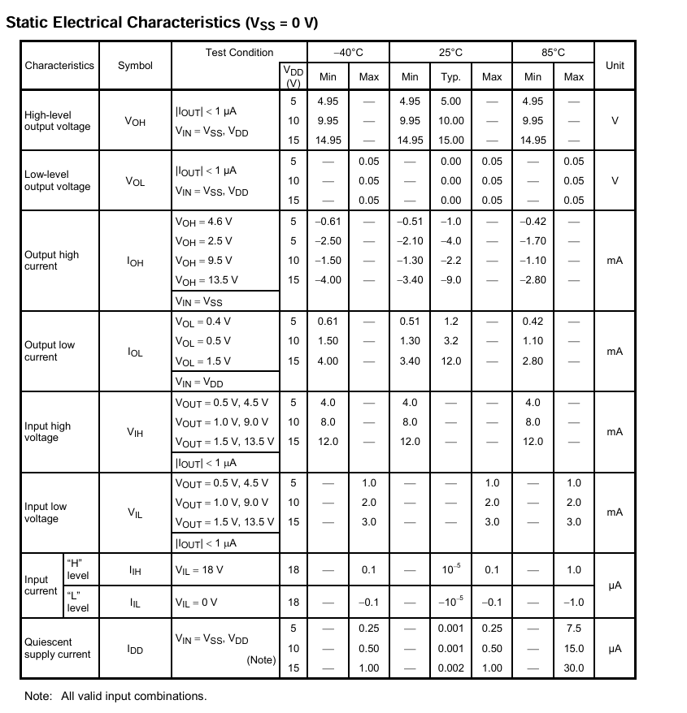

En primer lugar se realiza la búsqueda de los diferentes valores para cada parámetro establecidos por el fabricante y  a su vez una descripción detallada del funcionamiento del **IC**. (Todos los datos recopilados se encuentran en la carpeta [Datasheets](https://github.com/juamorenogo/Digital_2024_2/tree/1c44c5a6ecf68e097588859868e095a7c471f29c/Datasheets/Lab_01) (TC4069UBP).

Se establece la relación entre los diferentes pines, tal como se muestra en la siguiente imagen:

	nA --> Input
	nY --> Output

![[Lab_01/CD4069/Imagenes/im1.png]]

Cada par de terminales relacionados por _nA_ y _nY_ representa un inversor.

El circuito equivalente entregado por el datasheet se detalla a continuación, donde se puede apreciar el uso de transistores _MOSFET_, esto debido a que el funcionamiento de esta compuerta lógica se basa en la topología básica _CMOS_.

Por otro lado, se obtienen los datos típicos dados por el fabricante para diferentes parámetros:

---

[Volver](https://github.com/juamorenogo/Digital_2024_2/tree/main/Lab_01/SN70LS04)