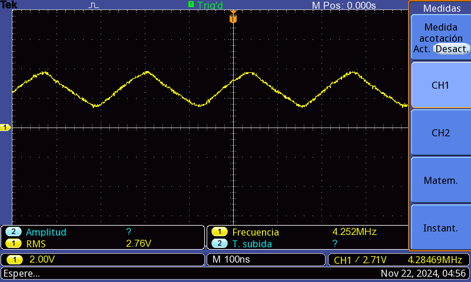
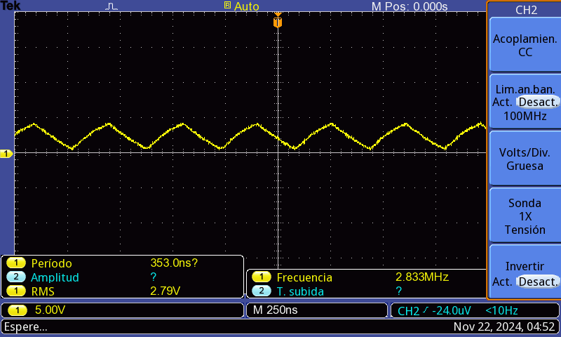
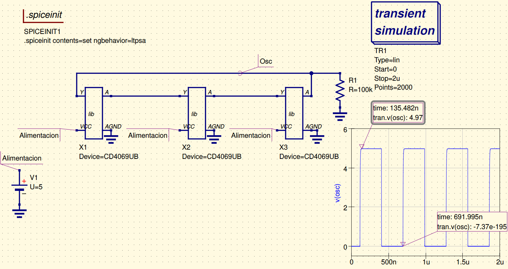
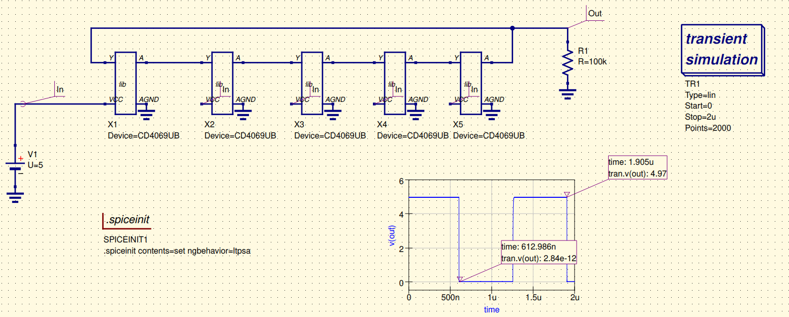

### Modelo usado

Para el oscilador de tres compuertas, se sabe que (dado que son compuertas NOT de la familia lógica **LS**, Low Power Schottky) la onda resultante será cuadrada, pero más particularmente se deformará según el tiempo de retardo de cada compuerta. Dada la referencia, se espera que el tiempo de retardo sea relativamente bajo, lo que ayuda a aumentar la velocidad de conmutación del oscilador. Lo que más podría llegar a afectar serían los efectos de la capacitancia y la resistencia en el camino que cursa la señal, en particular la frecuencia y la forma.

En el caso del anillo de cinco compuertas, dado que la señal pasa por más compuertas antes de retroalimentarse a la entrada inicial, genera la misma onda cuadrada pero con un mayor período (menor frecuencia). El aumento en el número de compuertas también aumentará el **período de oscilación**. Es decir, la frecuencia de oscilación será **más baja** que la de un oscilador de 3 compuertas.

### Resultados experimentales

Observando los resultados experimentales, vemos el siguiente caso para 3 inversores CMOS:

Y, por otra parte, observando los resultados para el caso con 5 CMOS:

### Resultados Simulados 

Observando los resultados simulados desde _Qucs_s_, vemos el siguiente caso para 3 inversores CMOS:

Cuya frecuencia se obtiene al generar el periodo con base en la diferencia de los puntos mostrados:

$$ f  = \frac  {1}{T} \approx 1.7969 \,\, MHz$$

Y, por otra parte, observando los resultados para el caso con 5 CMOS:

Cuya frecuencia se obtiene al generar el periodo con base en la diferencia de los puntos mostrados:

$$ f  = \frac  {1}{T} \approx 773.395 \,\, kHz$$

### Conclusión

Se puede observar que, según se aumentaron las compuertas, aumentó el periodo y por ende, disminuye la frecuencia. Por otra parte, vemos una tendencia muy poco perfecta a una onda cuadrada que se ve afectada en los tiempos de subida y de bajada por factores atribuibles al retardo, a la capacitancia y a la resistencia interna de los circuitos del integrado.

[Volver](https://github.com/juamorenogo/Digital_2024_2/tree/main/Lab_01/SN70LS04)

