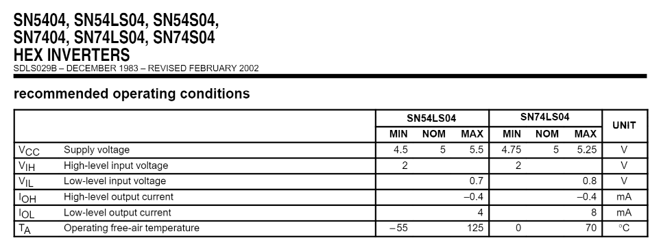

### SN 70LS04
En primer lugar se realiza la búsqueda de los diferentes valores para cada parámetro establecidos por el fabricante y  a su vez una descripción detallada del funcionamiento del **IC**. (Todos los datos recopilados se encuentran en la carpeta _Datasheets_)

Se establece se establece la relación entre los diferentes pines, tal como se muestra en la siguiente imagen:

	nA --> Input
	nY --> Output

Cada par de terminales relacionados por _nA_ y _nY_ representa un inversor.

![][Imagenes/Im3.png]

Por otro lado, se obtienen los datos tipicos dados por el fabricante para diferentes parametros:

A su vez se realiza el montaje 