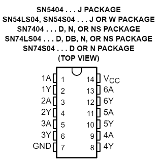

### SN 70LS04
En primer lugar se realiza la búsqueda de los diferentes valores para cada parámetro establecidos por el fabricante y  a su vez una descripción detallada del funcionamiento del **IC**.

Se establece se establece la relación entre los diferentes pines, tal como se muestra en la siguiente imagen:

	A --> Input
	Y --> Output

##### Datos del Datasheet:

A su vez se realiza el montaje 