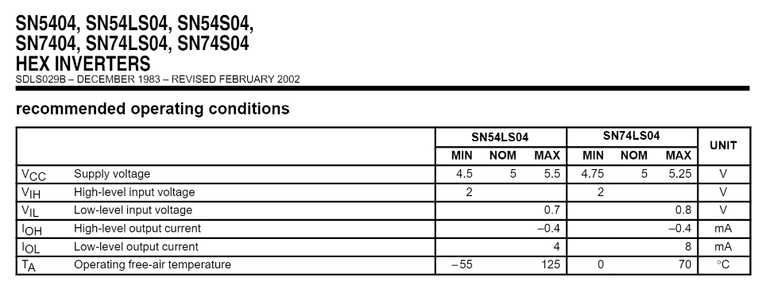

## SN 70LS04

### Preparación
En primer lugar se realiza la búsqueda de los diferentes valores para cada parámetro establecidos por el fabricante y  a su vez una descripción detallada del funcionamiento del **IC**. (Todos los datos recopilados se encuentran en la carpeta [Datasheets](https://github.com/juamorenogo/Digital_2024_2/tree/1c44c5a6ecf68e097588859868e095a7c471f29c/Datasheets/Lab_01).

Se establece se establece la relación entre los diferentes pines, tal como se muestra en la siguiente imagen:

	nA --> Input
	nY --> Output

Cada par de terminales relacionados por _nA_ y _nY_ representa un inversor.

El circuito equivalente entregado por el datasheet se detalla a continuación, donde se puede apreciar el uso de transistores _BJT NPN_, esto debido a que el funcionamiento de esta compuerta lógica se basa en la topología básica _TTL (Transistor - Transistor Logic)_.

Por otro lado, se obtienen los datos típicos dados por el fabricante para diferentes parámetros:

---
### Simulación
Para simular el comportamiento se usaron los modelos _SPICE_ obtenidos desde la siguiente referencia:

* [Modelos _SPICE_](https://github.com/digital-electronics-UNAL/2024-2/tree/main/labs/lab01/spice)

En primer lugar se realiza un montaje de prueba del circuito, donde se plantea visualizar si cumple con el comportamiento básico esperado de compuerta *NOT / Negador / Inversor*. La simulación se baso en el siguiente esquemático. A su vez, el modelo _SPICE_ usado solo simula los pines de alimentación y única compuerta _NOT_ .

Se aplica una tensión de alimentación de *5 V* entre los pines _VCC_ y _GND_. A su vez, se conecta en el pin de entrada _A_ una fuente generadora de señales con las siguientes características:

* Frecuencia de *1 kHz*.
* Amplitud de *5 V* ( Posteriormente variando entre *1.5 V* - *5 V* en _ViH_ ).
* Tiempo de caída y subida dado por el generador (estimado) de *15 ns*.

Las ondas resultantes ilustran el comportamiento esperado de un compuerta lógica _NOT_ , tal como se muestra a continuación:

