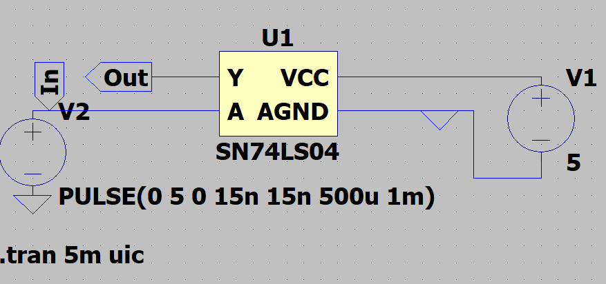

Para simular el comportamiento se usaron los modelos _SPICE_ obtenidos desde la siguiente referencia:

* [Modelos _SPICE_](https://github.com/digital-electronics-UNAL/2024-2/tree/main/labs/lab01/spice)

En primer lugar se realiza un montaje de prueba del circuito, donde se plantea visualizar si cumple con el comportamiento básico esperado de una compuerta *NOT / Negador / Inversor*. La simulación se baso en el siguiente esquemático. A su vez, el modelo _SPICE_ usado solo simula los pines de alimentación y una única compuerta _NOT_ .

Se aplica una tensión de alimentación de *5 V* entre los pines _VCC_ y _GND_. A su vez, se conecta en el pin de entrada _A_ una fuente generadora de señales con las siguientes características:

* Frecuencia de *1 kHz*.
* Amplitud de *5 V* ( Posteriormente variando entre *1.5 V* - *5 V* en _ViH_ ).
* Tiempo de caída y subida dado por el generador (estimado) de *15 ns*.

Las ondas resultantes ilustran el comportamiento esperado de un compuerta lógica _NOT_ , tal como se muestra a continuación:

