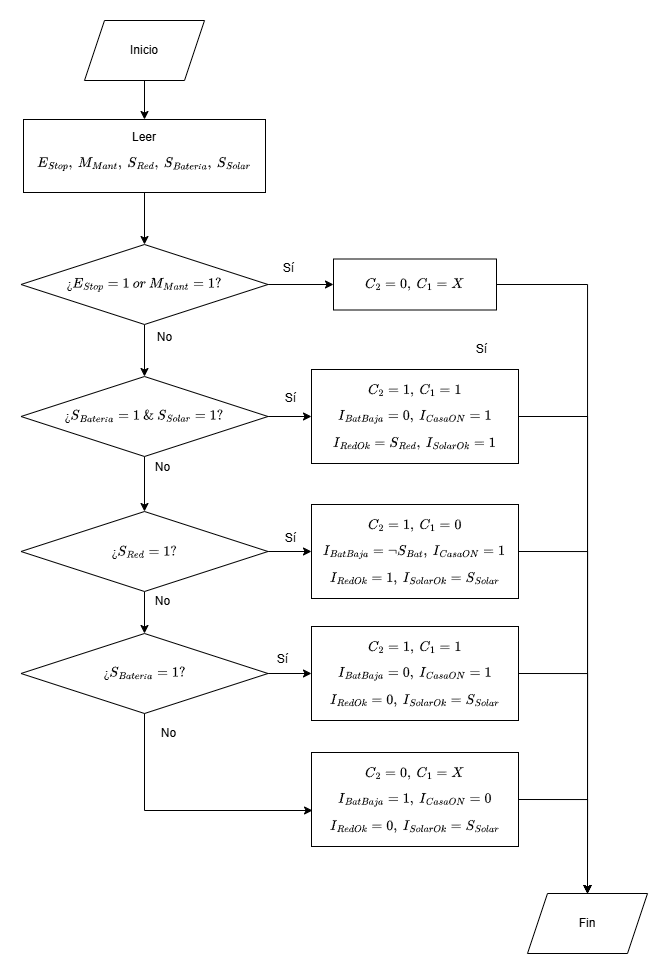

# Definición de entradas y salidas

Se determinan los sensores, el botón de paro de emergencia y otro botón de mantenimiento como las entradas:

+ $S_{red}$ : Sensor de red eléctrica (N.O./N.C. => señal BINARIA; 1 si hay red, 0 si no).
+ $S_{Batería}$ : Sensor de carga de batería  (N.O./N.C. => 1 si cargada, 0 si descargada).
+ $S_{Solar}$: Sensor de radiación solar (N.O./N.C. => 1 si hay suficiente radiación, 0 si no).
+ $E_{Stop}$ : Botón de paro de emergencia (1 = Paro, 0 = Normal).
+ $M_{Mant}$ : Botón/Señal de mantenimiento (1 = Mantenimiento, 0 = Normal).

Y se determinan los dos relés y cuatro indicadores como las salidas del sistema:

+ $C_1$ : Contactor para conmutar la fuente: (C1 energizado = usar Inversor/Batería; C1 desenergizado = usar Red).
+ $C_2$ : Contactor para energizar la casa (C2 energizado = casa energizada; C2 desenergizado = casa sin energía).
+ $I_{BatBa}$ : Indicador de batería descargada (1 = Batería baja, 0 = Ok).
+ $I_{CasaON}$: Indicador de casa energizada (1 = Casa con energía, 0 = sin energía).
+ $I_{RedOK}$: Indicador de disponibilidad de red (1 = Red presente, 0 = Red ausente).
+ $I_{SolarOK}$ : Indicador de radiación solar (1 = Solar presente, 0 = sin radiación).

Funcionalmente, se puede decir que las señales de entrada _deciden_ si la casa debe estar energizada o no, si la fuente de energía será el inversor/baterías o la red eléctrica, y qué indicadores encender.
# Caja Negra

# Tabla de verdad

| E_Stop | M_Paro_Mant | S_Red | S_Batería | S_Solar | C2 (Casa) | C1 (Fuente)  | Ind_Bat_Baja                    | Ind_Casa_ON | Ind_Red_OK | Ind_Solar_OK |
| ------ | ----------- | ----- | --------- | ------- | --------- | ------------ | ------------------------------- | ----------- | ---------- | ------------ |
| 1      | X           | X     | X         | X       | 0         | X            | Según Batería (1 si descargada) | 0           | S_Red      | S_Solar      |
| 0      | 1           | X     | X         | X       | 0         | X            | Según Batería                   | 0           | S_Red      | S_Solar      |
| 0      | 0           | 1     | 1         | 1       | 1         | 1 (Inversor) | 0                               | 1           | 1          | 1            |
| 0      | 0           | 1     | 0         | X       | 1         | 0 (Red)      | 1                               | 1           | 1          | S_Solar      |
| 0      | 0           | 0     | 1         | 0       | 1         | 1 (Inversor) | 0                               | 1           | 0          | 0            |
| 0      | 0           | 0     | 0         | X       | 0         | X            | 1                               | 0           | 0          | S_Solar      |
|        |             |       |           |         |           |              |                                 |             |            |              |

# Diagrama de Flujo

