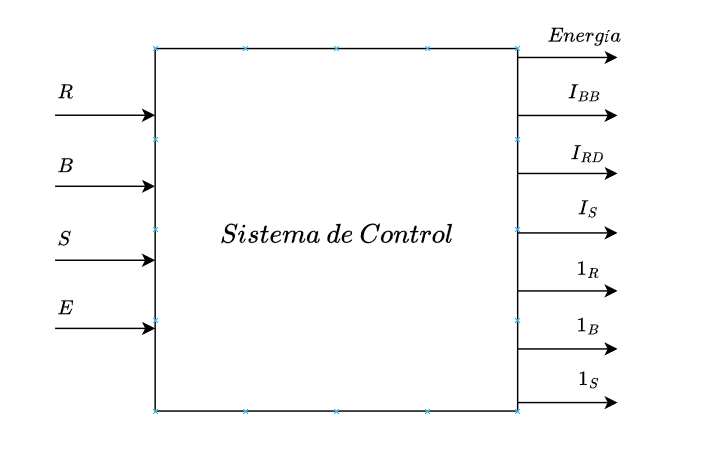

En primer lugar, se plantea un sistema de control con un diagrama de caja negra como el siguiente:

En donde se caracterizan las entradas y las salidas de la siguiente manera:

+ **Entradas**
	1.  S