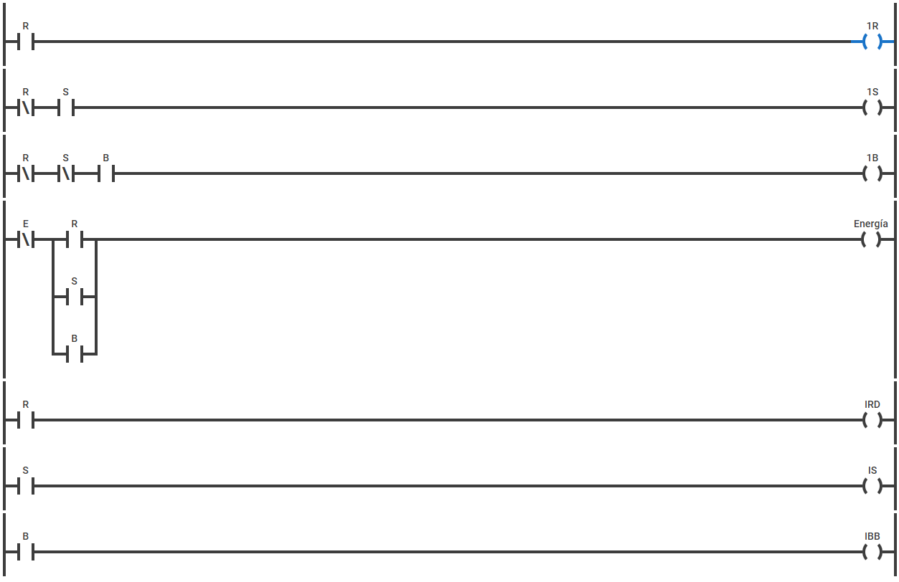

Para el circuito eléctrico en sí, se puede realizar por medio de una expansión en paralelo la rama correspondiente a cada salida representada por un LED. Los inversores se representarían por medio de cambios de interruptor normalmente abierto a normalmente cerrado, los AND por conexiones en serie y los OR por medio de conexiones en paralelo. Pasando del circuito digital a este, se obtendría el siguiente esquema:

Como se puede observar, hay varios interruptores que se repiten, pero es en la medida en que están conectados todos a un mismo relé en físico que cambia esos estados iniciales en cada uno de los interruptores. Se deja planteado así para comprensión, y dado el enfoque modular y claro del diseño.

Para el ladder se tiene el siguiente equivalente:

