## Circuitos lógicos

#### Circuito lógico inicial
Se muestran ahora dos circuitos lógicos equivalentes a las anteriores representaciones del diseño de control:

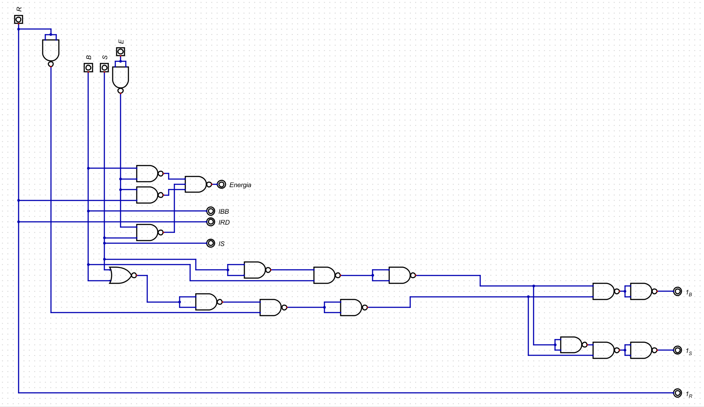

Este primer circuito se realizó por medio de compuertas lógicas universales, y sigue un flujo intuitivo que lleva a una comprensión sencilla de cómo se enciende cada salida con respecto a cada señal de entrada.

#### Circuito lógico reducido

Por otra parte, el segundo circuito lógico es el siguiente:

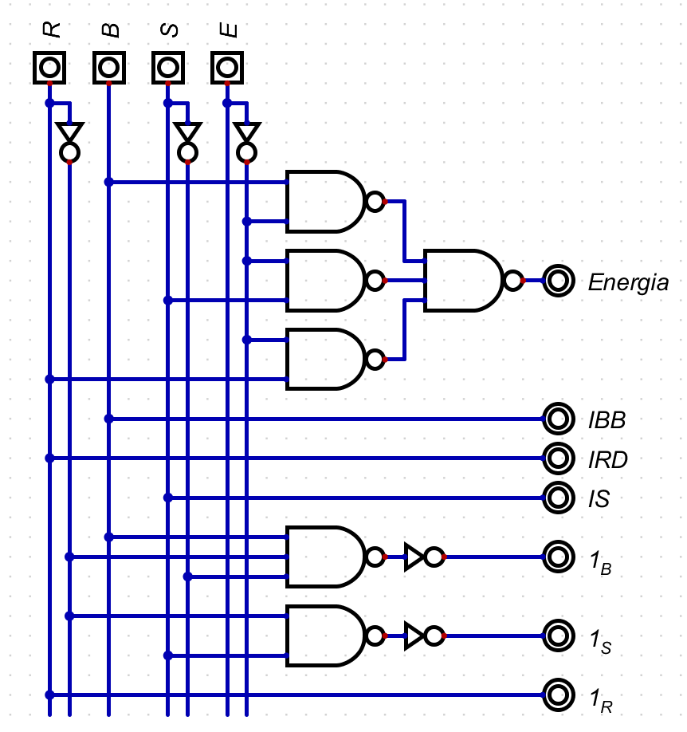

Que se produjo por medio del software Digital (si bien ambos circuitos fueron puestos para su visualización en el mismo software). Este muestra la versión reducida del circuito por medio de compuertas NAND y acaso dos inversores, con una la estructura estándar (entradas en una línea horizontal en la parte superior, con las salidas en línea vertical en la parte derecha).

## Mapas de Karnaugh y ecuaciones

Las reducciones para los mapas de Karnaugh según cada salida, para su formato en ecuación serían los siguientes:

(1) Para la salida de *Energía*:
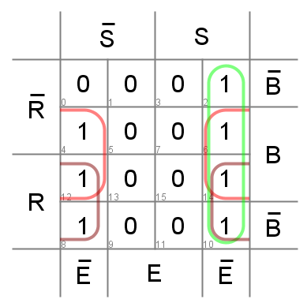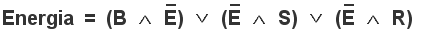

(2) Para la salida *IBB*:
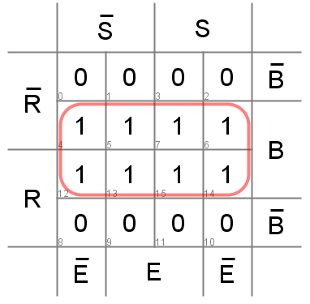

(3) Para la salida *IRD*:
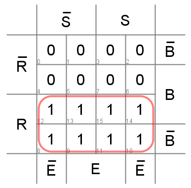

(3) Para la salida *IS*:
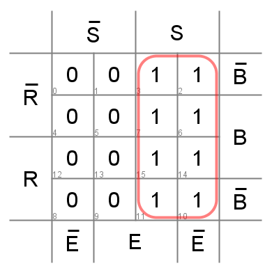

(4) Para la salida *1_b*:
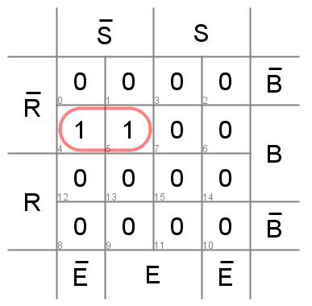
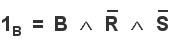

(5) Para la salida *1_s*:
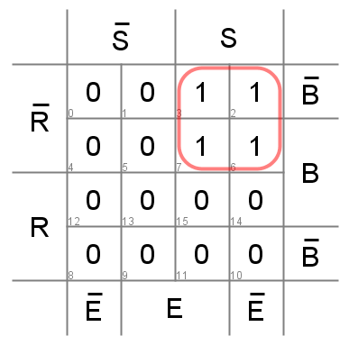

(6) Para la salida *1_R*:
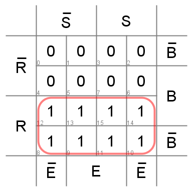
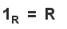

## Circuito con tablas de consulta (LUT)

Como adicional, aunque no profundizado, se muestra el circuito LUT que arroja digital:

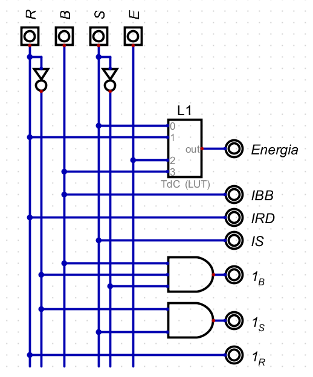