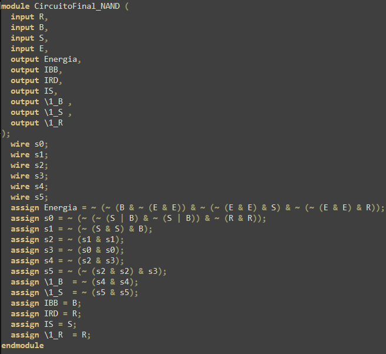
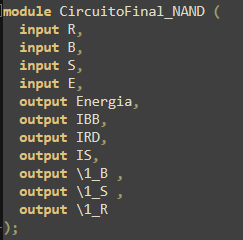
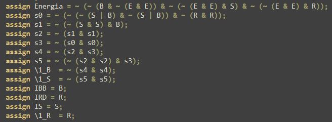

Se plantea, ahora, el siguiente código en verilog que describe el comportamiento buscado con el diseño:

Este código es un módulo en si, con sus entradas y salidas. Se declaran las mismas, con los nombres correspondientes, en esa primera parte:

Luego, ya en el código, se declaran variables intermedias "wire" (cables). Estas servirán para resumir el código y plantear las salidas de forma más sencilla. Luego, se plantea la lógica combinacional propiamente:

Como se ve, en estas asignaciones se reflejan las ecuaciones booleanas propias dada la sintaxis de verilog. Luego, estas se asignan a las variables de salida del módulo. Con esto se completa el código y su funcionalidad.