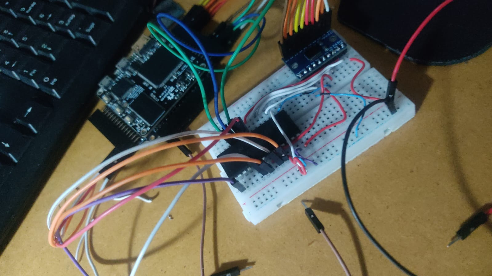

Inicialmente se supuse que seria necesario usar un convertidor lógico CMOS  a TTL, no obstante, se logro comprobar que no era necesario debido a que todos los pines necesarios a excepción del clock podían ser fijos, por lo que, solo era necesario conectarlos a la alimentación del integrado:

Ahora se presenta el esquemático del integrado:

La etapa analógica (cuya entrada es la señal que varía de 0V a 5.2V) entra por la entrada IN3. Para esto, se indica por medio de los pines ADD A, ADD B y ADD C que esta entrada, colocándolos respectivamente en L, H, H. 

El clock, para un funcionamiento adecuado, se seteó a 10kHz.

Start se puso en corto con EOC, puesto que Start indica el inicio de pulso de inicio de conversión y la salida EOC indica el fin de la conversión. Como debe operar de forma continua la medición, se unen.

ALE se ajusta por medio del código en verilog para habilitar el latch de dirección antes del set en Start.

Se une la tierra del ADC con la de la FPGA, se alimenta VCC con 5V y se ajustan las referencias de VERF(+) con los 5.2V dados y VREF(-) con 0V, ya para indicar finalmente el rango completo de medición.

Los pines de $2^n$ se conectan a las entradas del FPGA, ya que son la representación binaria del número a medir y los demás pines del ADC se dejan flotantes.
