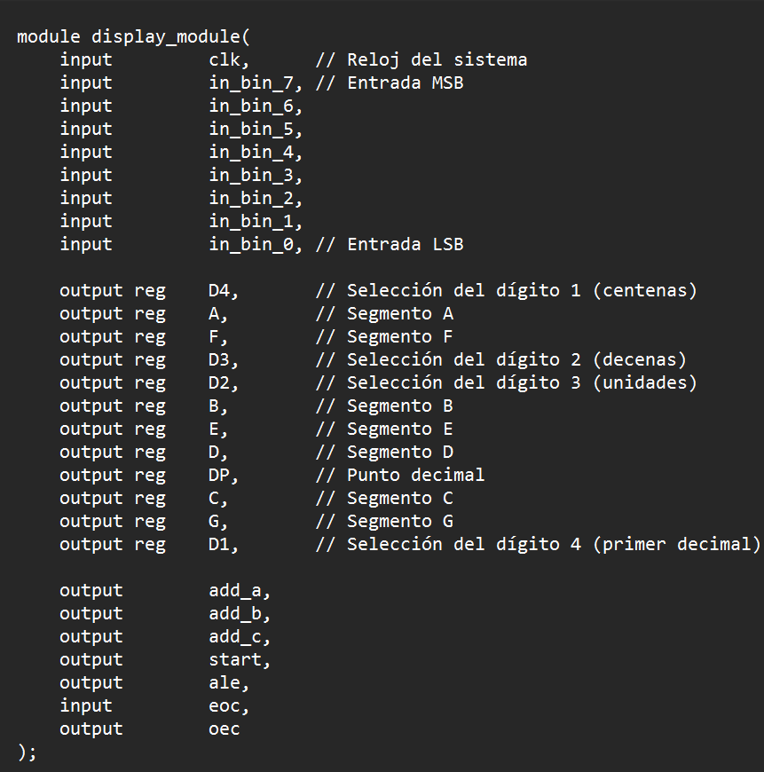
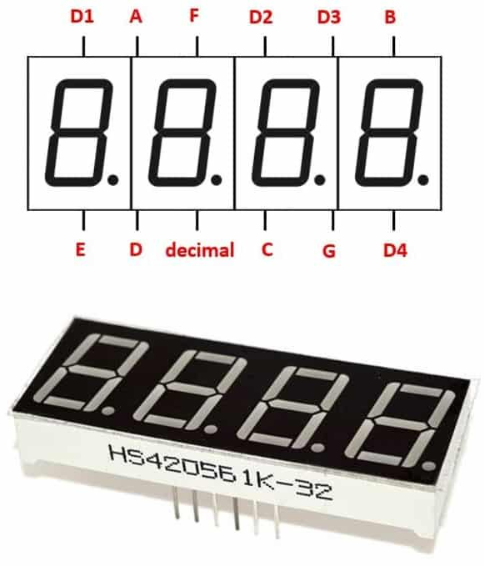
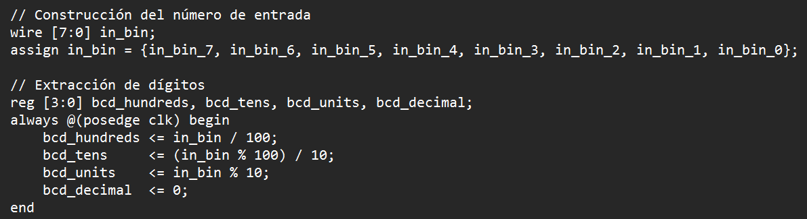
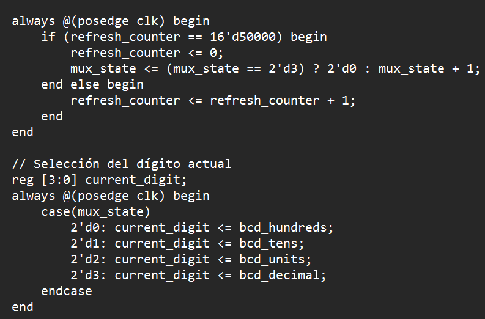
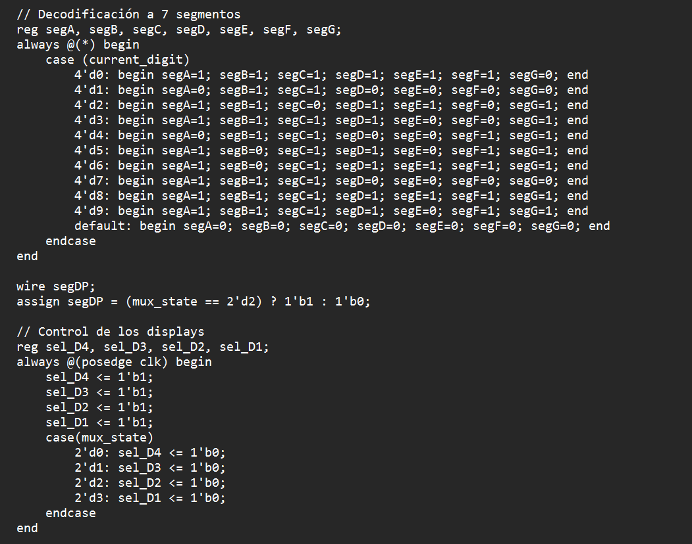
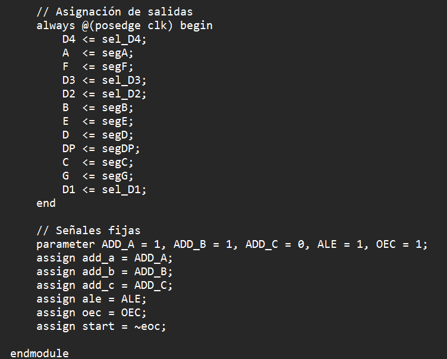

Para comenzar se observan las entradas del módulo:

Como se puede observar, se declaran las entradas _in_bin_ provenientes del ADC que pueden ser números binarios del 0 al 255. Las salidas del módulo son registros de 1 bit que son todas entradas del display de 4 dígitos 7 segmentos. Se muestra los pines del display:

El número de entrada se conserva en un solo registro y se realizan operaciones de división y módulo para hallar los dígitos de unidades, decenas y centenas:

Debido a que, por la funcionalidad del display de 4 dígitos solo puede alumbrar uno a la vez, se debe configurar un temporizador para que cambie el dígito mostrado cada cierto tiempo. Se escoge el tiempo de visualización por dígito y se crean dos estructuras en verilog: una que determina el cambio de un dígito a otro y la otra que determina cuál es el dígito en particular (colocando D1, D2, D3 o D4 en activos y los demás inactivos):

Acto seguido, se decodifica para 7 segmentos el número en particular que se dará en los pines de salida, se decide que el número decimal en el tercer dígito (el cuarto es un decimal) y se asignan los demás pines según la estructura anterior:

Finalmente se termina el módulo asignando esto a las salidas declaradas del módulo y, para la operación correcta del ADC, se dejan ciertas salidas constantes:

