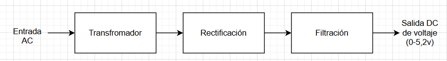
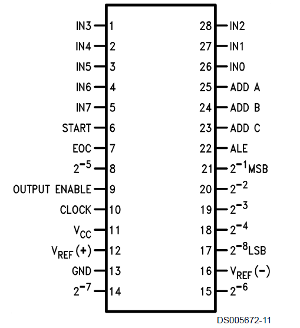
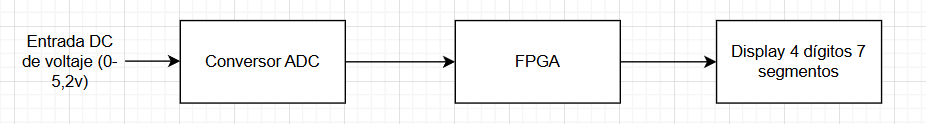

El objetivo del laboratorio es realizar un voltímetro que indicase el nivel con respecto a una referencia y visualizarlo en cualquier elemento.

Se planteó un montaje analógico según el cual, por medio de un transformador, una etapa de rectificación y otra de filtración, se obtenía una señal de $5.2 V$ que constituía la entrada analógica para un conversor ADC.

Esto constituye la etapa analógica. Para la parte de conversión ADC se empleó el integrado $ADC0809$. En base al siguiente diagrama de conexiones se dispuso para obtener una salida digital que, en binario, puede ir de 0 a 255 (8bits de salida):

Las ocho salidas que representan el número escalado, luego, entran a la FPGA para ser interpretadas para visualizarse en un display de 4 dígitos de 7 segmentos. El flujo de trabajo sería el siguiente:

