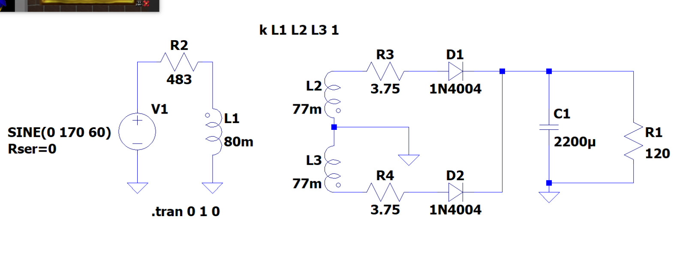

A continuación se presenta el diseño analógico usado para poder obtener el valor pico de tensión de una red eléctrica suponiendo que es de 255Vp. Se usa el siguiente circuito:

Se usa un transformador de relacion aproximada por las inductancias expuestas y con un tap central para facilidad de uso. Asi mismo, para poder tener un valor estable, lineal y sobre todo seguro para el integrado y la FPGA se añade al circuito lo siguiente:

Finalmente se realiza el montaje y queda de tal manera:

