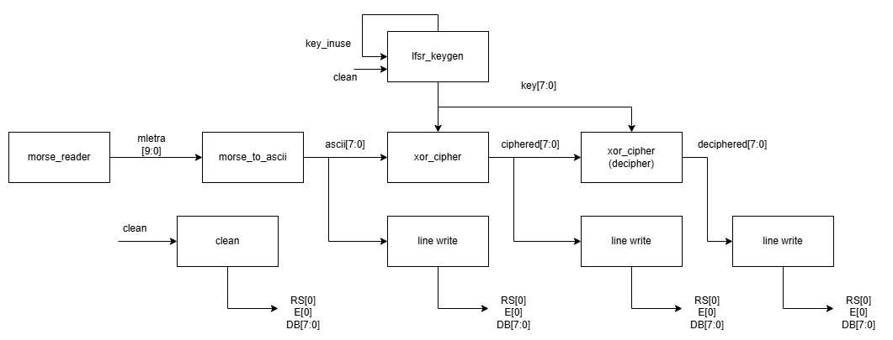

Se solicita hacer una máquina de estados que cumpla una función en el proyecto e implementarla en verilog para este. 

Se muestra el diagrama de bloques para el proyecto:

Dicha imagen muestra los diferentes módulos de verilog a través de los cuales se mueven entradas y salidas para mostrar en una display LCD 20x4 la encriptación, desencriptación y palabra base de un código morse.

Se escoge emplear una máquina de estados en los módulos de **line_write** y **clean**, pues ambos requieren de una visualización en la LCD.
