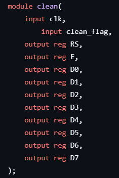
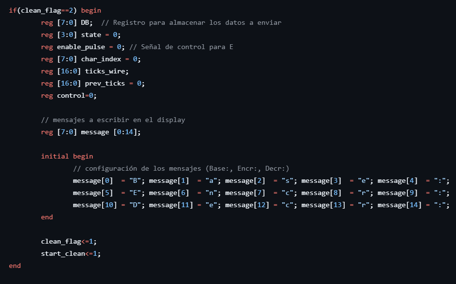
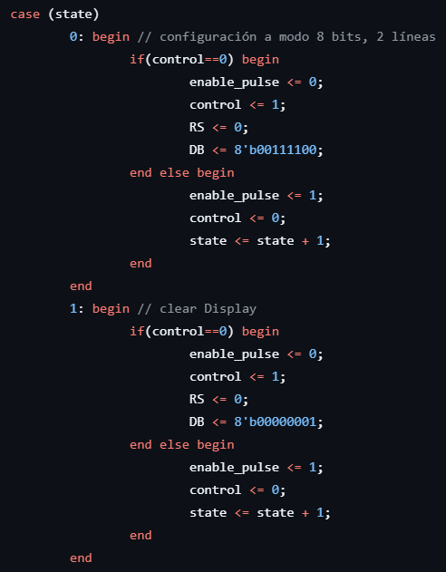
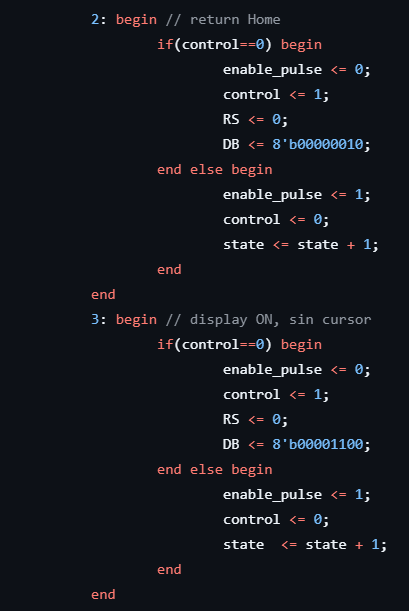
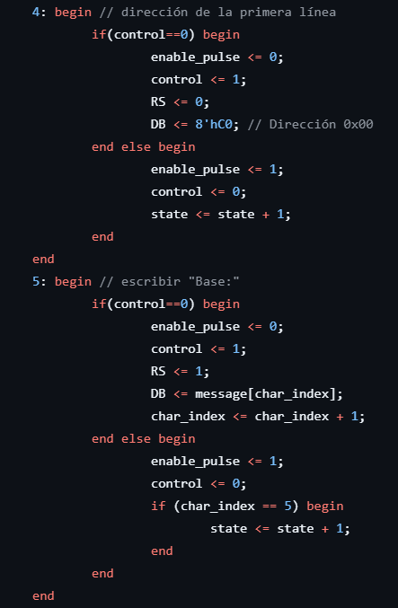

### Para "clean"

El objetivo de este módulo setear (preparar) la LCD para mostrar las palabras:
- En la primera línea de la LCD: "Base:"
- En la segunda línea de la LCD: "Encr:"
- En la tercera línea de la LCD: "Decr:"

Para esto, se declara el módulo de la siguiente forma:

Donde no hay entradas porque la FPGA puede escribir estas palabras sin dependencia de entradas, y solo declara las salidas que son los pines de entrada del LCD 20x4.

La tarea se logra de la siguiente manera. Primero se declaran las puertas lógicas a emplear para la máquina de estados y se guarda la palabra por medio de una matriz:

En el primer estado se setea para que reciba todas las líneas del bus de datos: 8 bits. Además, se configura para que se activen ambas líneas a la vez y se puedan emplear para el resto de acciones.

El segundo estado hace una limpieza preliminar, necesaria, del display.

Se regresa a la dirección inicial 0x00 del display, la cual se llama HOME y se enciende el display (ya que tiene una opción de apagado digital) y se quita el cursor. Ya con esto se puede proceder a escribir las palabras.

Para escribir la palabra base en la primera línea, se sitúa la dirección de escritura en el inicio del display y en el siguiente estado se va extrayendo de forma iterativa, regresando iterativamente al mismo estado por medio de una estructura de contador con condicional, cada letra del registro de la matriz que guarda la palabra, hasta escribirla comp
