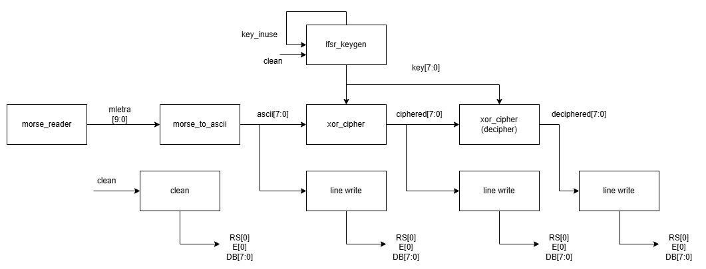

### Descripción general de la máquina de estados

Se solicita hacer una máquina de estados que cumpla una función en el proyecto e implementarla en verilog para este. 

Se muestra el diagrama de bloques para el proyecto:

Dicha imagen muestra los diferentes módulos de verilog a través de los cuales se mueven entradas y salidas para mostrar en una display LCD 20x4 la encriptación, desencriptación y palabra base de un código morse.

Se escoge emplear una máquina de estados en los módulos de **line_write** y **clean**, pues ambos requieren de una visualización en la LCD. El **diagrama FSM** se puede hacer de la siguiente manera:

Nótese que, en vez de reiniciar a un estado inicial (cíclico), llega a un estado final en el cual reposa. Esto se debe a la consecución lineal que, por suficiencia, se definió para el proyecto, ya que podría regresar en vez de esto a un estado IDLE en el cual esperara una entrada nueva, pero esto no es necesario para el proyecto.

A continuación se presenta el funcionamiento practico del modulo:

Así mismo, se muestran videos del funcionamiento. El primero refleja usando leds, los diferentes cambios en cada pin que permitirán la correcta configuración del LCD:

https://youtu.be/bNidXW4C4l0

Y finalmente se adjunta el video de explicación del funcionamiento del modulo y la muestra de que el modulo cargado si cumple con su función:

https://youtu.be/NbGsm1Sb04o

## RTL

Se dispone a continuación el diagrama RTL generado usando el codigo:

Adicionalmente se crea un código de generación de ticks que en general se trata simplemente de un divisor de frecuencia para poder generar los valores temporales necesarios para la configuración de la LCD.
